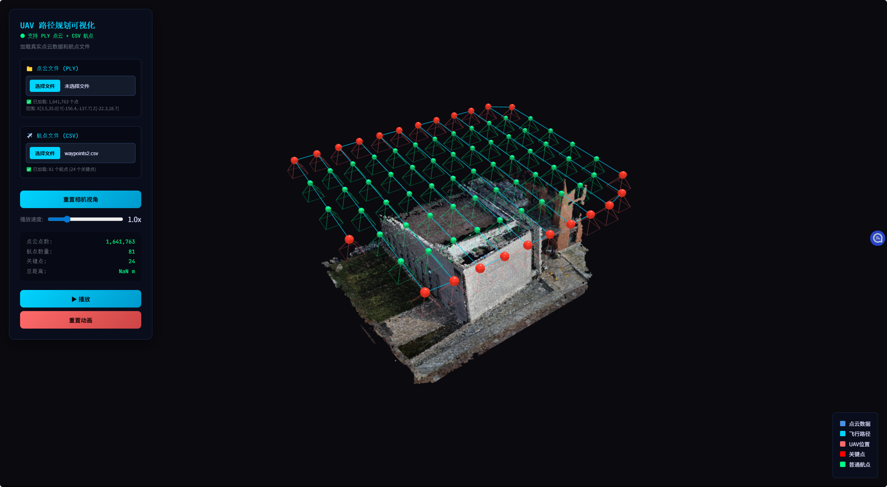
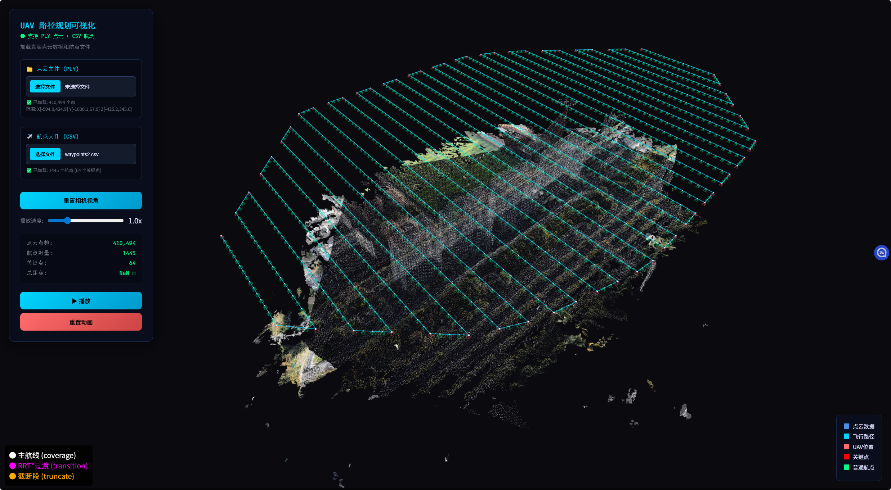
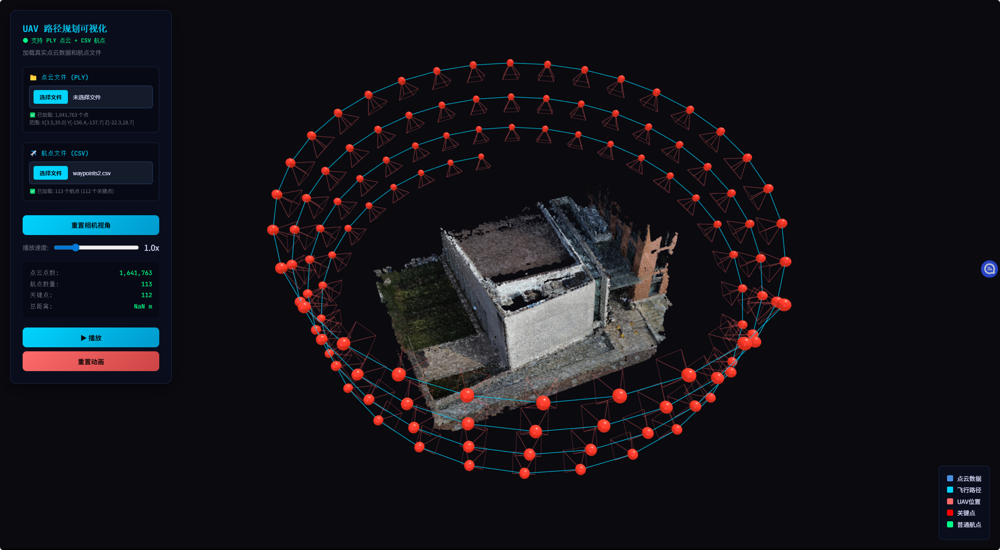
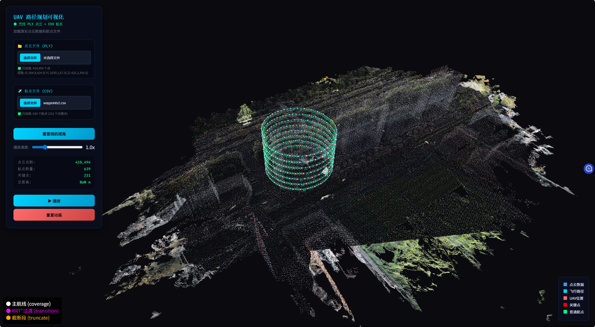
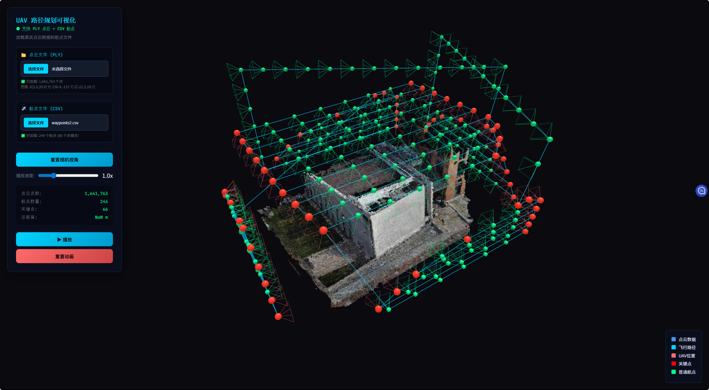
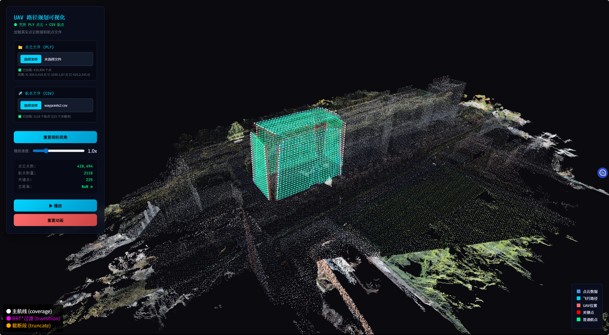
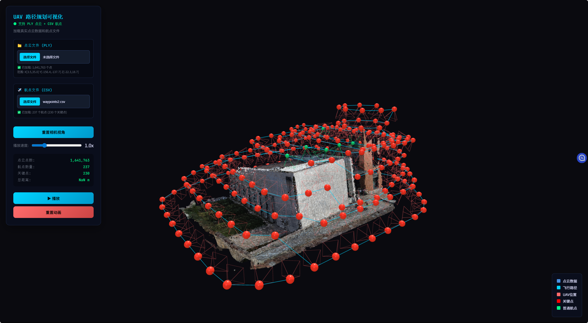
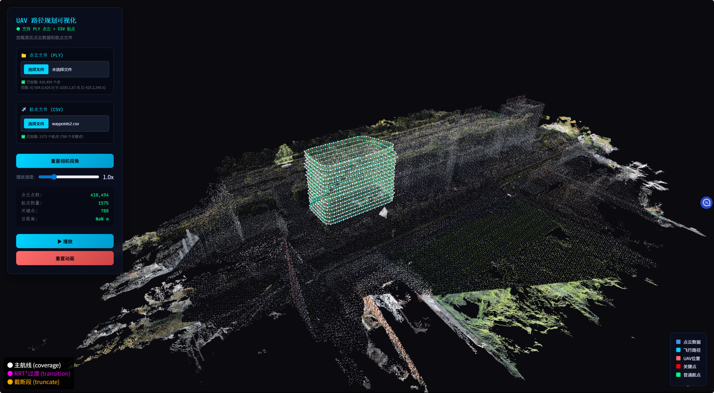

# UAV Coverage Planners

轻量演示仓库：用于 UAV 覆盖路径规划的四阶段流水线（几何生成 → 约束校验 → 优化 → 过渡轨迹生成），支持四种主流覆盖算法并输出稀疏拍照关键点与密集插值轨迹。

## 主要特性
- 四阶段流水线：Geometry → Validation → Optimization → Transitions
- 支持算法：`boustrophedon`, `oblique`, `oblique_oneplane`, `spiral`, `viewpoint_optimized`
- 自适应体素碰撞检测与确定性过渡规划器
- 输出：关键点（keypoints）与可导出的轨迹（JSON / CSV）

## 快速安装
```bash
python -m venv .venv
source .venv/bin/activate
pip install -e .
```

## 主要示例脚本
仓库提供了若干独立的示例启动脚本，直接在仓库根目录运行即可。推荐以 `oblique.py` 作为主要示例阅读和修改，因为它涵盖点云、AABB 裁剪、3d-tiles 支持与常用调参项：

- `oblique.py`  —— 主要示例（点云输入、AABB、3d-tiles 支持）
- `boustrophedon.py` —— 区域（region-only）示例（无点云，按矩形区域生成）
- `spiral.py` —— 螺旋算法示例
- `spiral_nopc.py` —— 螺旋算法示例（无点云，圆心+半径+高度）
- `oblique_oneplane.py` —— 单斜面多边形示例（无点云）
- `viewpoint_optimized.py` —— 改进的视点（box-wrap / TSP）示例

运行示例：
```bash
python oblique.py
python boustrophedon.py
python spiral.py
python spiral_nopc.py
python oblique_oneplane.py
python viewpoint_optimized.py
```

上面的脚本都会构造一个 `MissionConfig` 实例并调用 `CoveragePlanner(config).plan()`；运行前请根据你的数据修改 `pointcloud_path`、`algorithm`、`altitude`、`camera` 等字段。

## 常用配置与参数说明
（下列参数名与 `MissionConfig` 字段对应，示例参见 `oblique.py`）

- `algorithm`: 算法名（`oblique`/`oblique_oneplane`/`boustrophedon`/`spiral`/`viewpoint_optimized`）。
- `pointcloud_path`: 点云文件或 3d-tiles 的 `tileset.json` 路径；若启用 `region_only_enabled=True` 或 `oblique_oneplane` 可设为 `None`。
- `gsd`: 目标 GSD（米/像素）。
- `altitude`: 飞行高度（米）。
- `speed_ms`: 飞行速度（m/s）。
- `side_overlap`, `front_overlap`: 侧向/前向覆盖率（0..1）。
- `safety_distance`: 点云外侧的安全距离（米）。
- `voxel_size`: 碰撞检测体素分辨率（米）。
- `capture_interpolation_factor`: 插值因子，控制关键点间插入的拍照点密度。

Viewpoint（`viewpoint_optimized`）专用常用参数：
- `viewpoint_shape_method`: `convex` 或 `alpha`（alpha-shape 更贴合复杂轮廓，但计算更慢）。
- `viewpoint_alpha`: alpha 参数（仅在 `alpha` 方法生效）。
- `viewpoint_layer_height_step_m`: 层间高度步长（米）。
- `viewpoint_ring_arc_step_m`: 环上采样步进（米）。
- `viewpoint_min_points_per_layer`, `viewpoint_layer_area_jump_ratio`：控制层插入/跳过策略。

## AABB（裁剪框）用法
仓库支持在点云上进行 AABB 裁剪以加速处理，示例在 `oblique.py` 中实现了两种设置方式：

- 方式 A：直接提供齐次变换矩阵
  - 设置 `AABB_TRANSFORM` 为 4x4 齐次变换矩阵（NumPy 数组），并设置 `AABB_SIZE = (sx, sy, sz)`。
  - 作用：在任意位置与朝向上构造一个局部长方体并裁剪点云，只保留该盒内点。

- 方式 B：中心点 + 偏航角（更便捷）
  - 设置 `AABB_CENTER = (x,y,z)`、`AABB_YAW_DEG`（度）及 `AABB_SIZE`。

若不希望裁剪，将 `AABB_SIZE` 设为 `None` 即可（默认禁用）。AABB 常用于：裁剪大型场景到兴趣区、减少点云数量、稳定局部法线估计。

示例（来自 `oblique.py`）：
```python
AABB_TRANSFORM = np.array([...], dtype=np.float64)
AABB_SIZE = (43.0, 70.0, 60)
# 或者使用 AABB_CENTER / AABB_YAW_DEG
```

## 3d-tiles（tileset.json）支持
仓库支持直接读取 Cesium 3D Tiles（`tileset.json`）并可配置若干参数以平衡性能与精度：

- `tiles_kind`: 输入类型（`"auto"` 或显式指定）。
- `tiles_max_points`: 单层最大点数阈值（超过会触发下采样或分片）。
- `tiles_lod_max`: 最大 LOD 层级，用于控制细节层级。
- `tiles_output_frame`: 输出坐标系（例如 `enu`）。
- `tiles_input_crs`: 输入坐标参考系，例如 `ecef`。
- `tiles_convert_to_ply`: 可选把 tileset 转成 PLY 并用 PLY 作为后续输入（`tiles_converted_ply_path` 指定输出文件）。

这些参数帮助你在加载大型 tiles 数据时控制内存占用与计算成本，必要时先转换为更易处理的 PLY 再运行规划。

## 导出与可视化
- 导出：`result.export_json("trajectory_xxx.json")`、`result.export_csv("waypoints_xxx.csv")`。
- 可视化（仓库内的简单示例）：
```bash
cd visualization
python -m http.server 8080
# 在浏览器打开 visualization/index.html 并加载生成的点云/轨迹
```

## 说明与建议
- 示例脚本均为可编辑的起点：把 `pointcloud_path` 改为你的数据路径、调整 `camera` 与 GSD、再运行以获得规划结果。
- 如果需要把 Stage6（间断桥接）生成的补间点视作拍照点与基于点云法线的朝向，可以使用代码中已集成的 Stage6 行为（默认已将修复点标记为拍照点并尝试使用点云法线设置飞机朝向）。
- 点云预处理（`pointcloud_preprocess_enable=True`）在噪声点云上通常能提升法线稳定性与规划质量。

## 可视化示例图片
仓库内 `png/` 目录包含若干示例截图，可用于快速查看不同算法的输出：

#### Boustrophedon



#### Spiral



#### Oblique



#### Viewpoint



